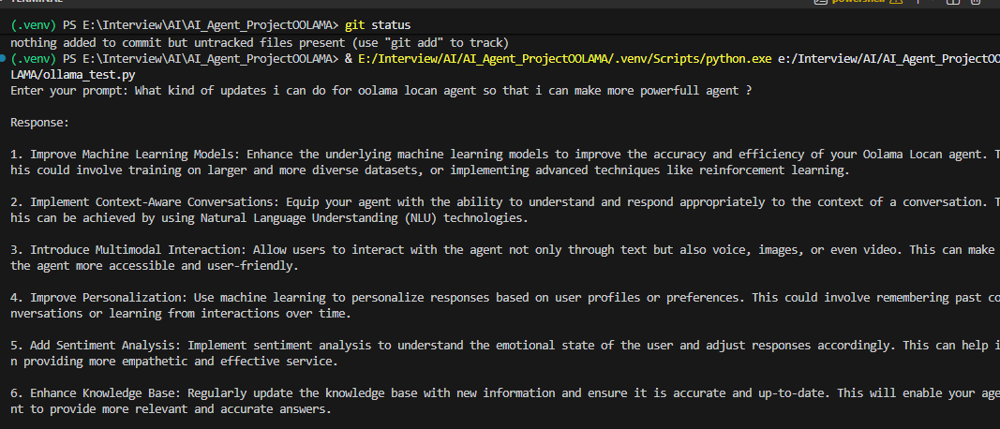
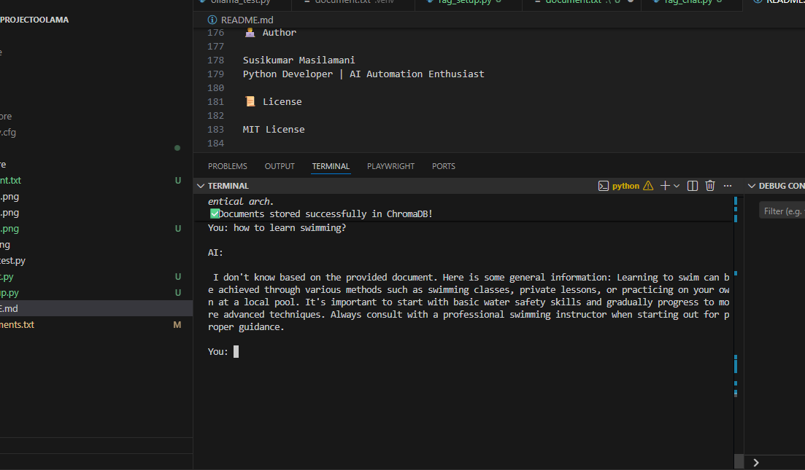

🤖 Local AI Agent using Ollama (Python)

A lightweight, production-style local AI agent built using Python + Ollama.
Runs completely offline using locally hosted LLM models like Mistral, Gemma, and Phi3.

🎯 Project Purpose

This project demonstrates how to:

Run LLMs locally without cloud APIs

Build secure, privacy-first AI systems

Integrate Python with a local AI runtime

Design a scalable AI agent foundation

Understand real-world LLM architecture

🧠 What You Will Learn

How Ollama runs models locally

Connecting Python to a local AI server

CLI-based AI application design

Managing virtual environments

Performance differences between LLM models

Offline AI deployment concepts

🏗 System Architecture
User (CLI Input)
        ↓
Python Application
        ↓
Ollama Python SDK
        ↓
Ollama Server (127.0.0.1:11434)
        ↓
LLM Model (Mistral / Gemma / Phi3)
        ↓
AI Response

AI_Agent_ProjectOOLAMA/
│
├── rag_setup.py              # Creates embeddings + stores in Chroma DB
├── rag_chat.py               # CLI-based RAG chatbot
├── appUistreamLit.py         # Streamlit UI chatbot
├── ollama_test.py            # Simple Ollama test script (optional)
│
├── db/                       # Chroma persistent vector database
│
├── requirements.txt          # Dependencies
├── README.md
├── .gitignore
│
├── data/                     # PDFs or documents (if you added PDF support)
│
└── assets/                   # Screenshots for README

⚙️ Requirements

Python 3.8+

Ollama installed

Windows / macOS / Linux

8GB RAM minimum (16GB recommended for 7B models)

🚀 Setup & Installation
1️⃣ Clone the Repository
git clone https://github.com/SusiKumarm/AI_Agent_ProjectOOLAMA.git
cd AI_Agent_ProjectOOLAMA

2️⃣ Create Virtual Environment
python -m venv .venv

Activate:

Windows

.venv\Scripts\activate

Mac/Linux

source .venv/bin/activate

3️⃣ Install Dependencies
pip install -r requirements.txt

4️⃣ Install & Verify Ollama

Download: https://ollama.com

ollama --version

5️⃣ Pull a Model

High Quality:

ollama pull mistral

Balanced:

ollama pull gemma

Lightweight:

ollama pull phi3:mini

▶️ Run the Application
Start Ollama Server
ollama serve

Keep this running.

Run Python Script
python ollama_test.py

Type your prompt and start interacting.
Type exit to stop.

📊 Model Comparison
Model	RAM	Speed	Quality	Best For
mistral	High	Medium	Excellent	Production-level tasks
gemma	Medium	Fast	Good	Balanced workloads
phi3:mini	Low	Very Fast	Moderate	Low-memory systems
🔐 Security & Privacy

Fully offline execution

No external API calls

No data leaves your machine

Suitable for enterprise/internal environments

🚀 Future Enhancements

Add conversation memory

Streaming token output

FastAPI backend

Streamlit Web UI

Docker support

Structured logging

💡 Possible Use Cases

AI Test Case Generator

Offline Code Assistant

Enterprise AI Chatbot

QA Automation Helper

Internal Knowledge Bot

🏆 Resume Highlights

Designed a local AI agent using Python and Ollama

Implemented offline LLM integration

Built privacy-first AI architecture

Structured a modular, production-ready project

👨‍💻 Author

Susikumar Masilamani
Python Developer | AI Automation Enthusiast

📜 License

MIT License

DEMO:-Results

==============================================
After RAG system :-

oolama serve in cmd 

First time:
python rag_setup.py

Then:
python rag_chat.py

if we dont have data in docs it will retrive from his intelligence 

-----------------------------
After adding UI streamlite

------------------------------
User (Streamlit UI)
        ↓
Embedding Model (MiniLM)
        ↓
ChromaDB (Search similar docs)
        ↓
Ollama (phi3:mini)
        ↓
Answer shown in UI
---------------------------

pip install -r requirements.txt

streamlit run appUistreamLit.py

with RAG

with LLM model

