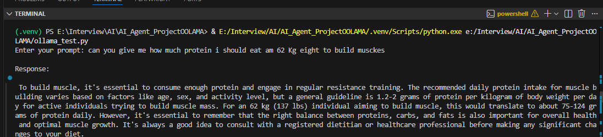
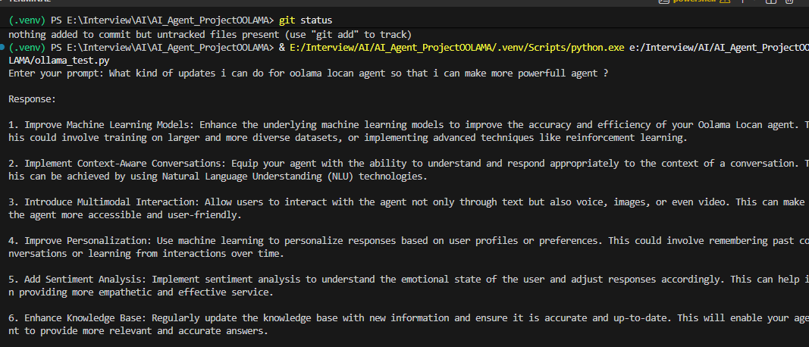
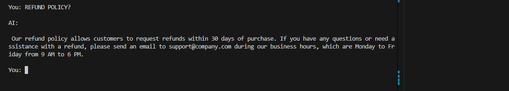
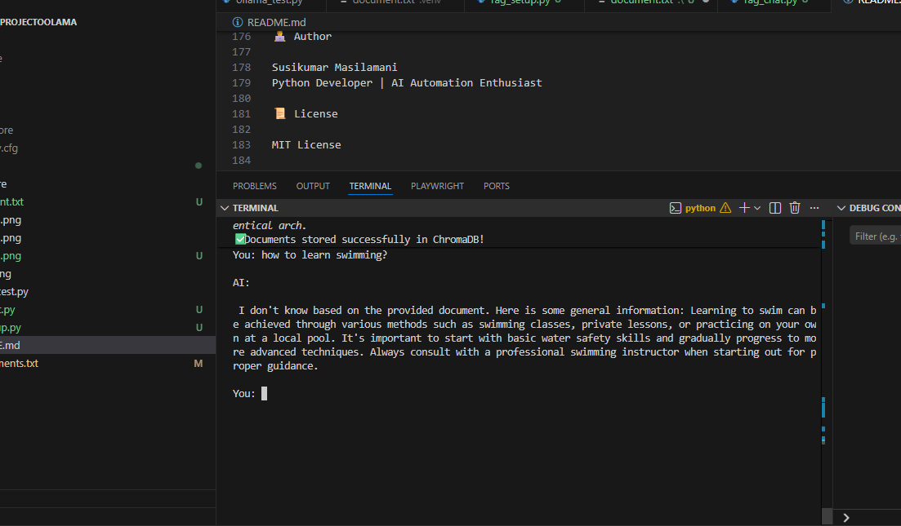
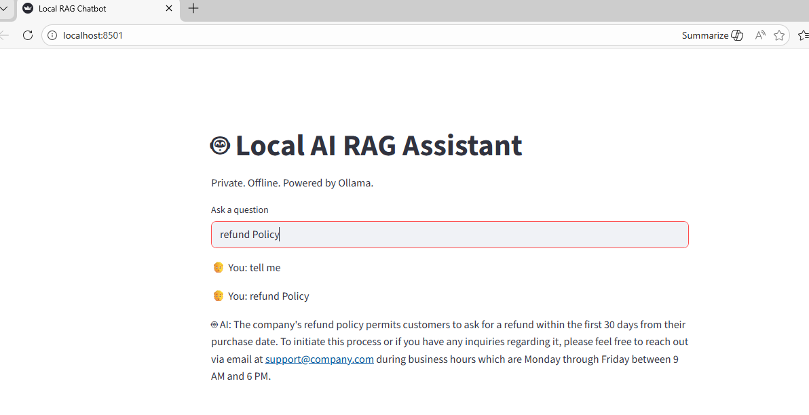
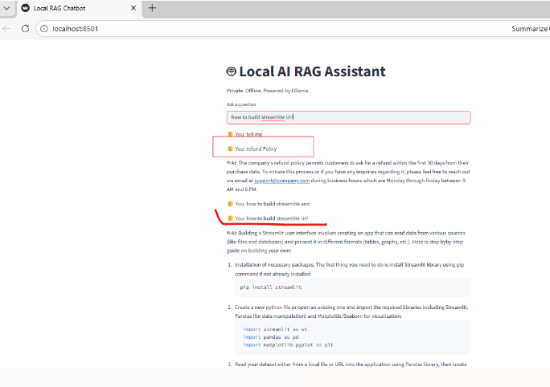
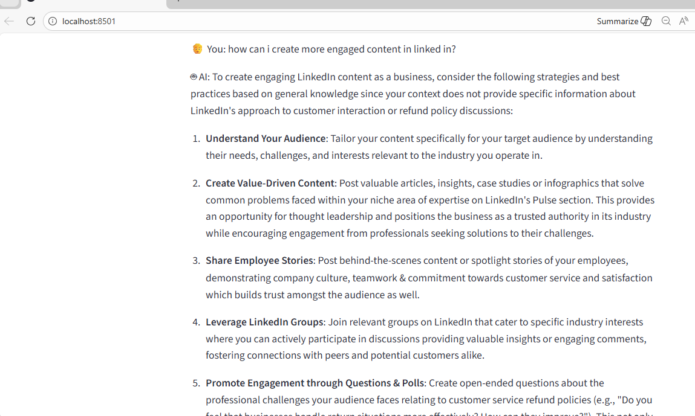
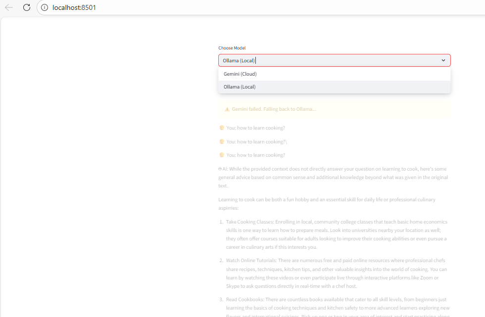

🤖 Local AI Agent using Ollama (Python)

A lightweight, production-style local AI agent built using Python + Ollama.
Runs completely offline using locally hosted LLM models like Mistral, Gemma, and Phi3.

🎯 Project Purpose

This project demonstrates how to:

Run LLMs locally without cloud APIs

Build secure, privacy-first AI systems

Integrate Python with a local AI runtime

Design a scalable AI agent foundation

Understand real-world LLM architecture

🧠 What You Will Learn

How Ollama runs models locally

Connecting Python to a local AI server

CLI-based AI application design

Managing virtual environments

Performance differences between LLM models

Offline AI deployment concepts

🏗 System Architecture
User (CLI Input)
        ↓
Python Application
        ↓
Ollama Python SDK
        ↓
Ollama Server (127.0.0.1:11434)
        ↓
LLM Model (Mistral / Gemma / Phi3)
        ↓
AI Response

AI_Agent_ProjectOOLAMA/
│
├── rag_setup.py              # Creates embeddings + stores in Chroma DB
├── rag_chat.py               # CLI-based RAG chatbot
├── appUistreamLit.py         # Streamlit UI chatbot
├── ollama_test.py            # Simple Ollama test script (optional)
│
├── db/                       # Chroma persistent vector database
│
├── requirements.txt          # Dependencies
├── README.md
├── .gitignore
│
├── data/                     # PDFs or documents (if you added PDF support)
│
└── assets/                   # Screenshots for README

⚙️ Requirements

Python 3.8+

Ollama installed

Windows / macOS / Linux

8GB RAM minimum (16GB recommended for 7B models)

🚀 Setup & Installation
1️⃣ Clone the Repository
git clone https://github.com/SusiKumarm/AI_Agent_ProjectOOLAMA.git
cd AI_Agent_ProjectOOLAMA

2️⃣ Create Virtual Environment
python -m venv .venv


Activate:

Windows

.venv\Scripts\activate


Mac/Linux

source .venv/bin/activate

3️⃣ Install Dependencies
pip install -r requirements.txt

4️⃣ Install & Verify Ollama

Download: https://ollama.com

ollama --version

5️⃣ Pull a Model

High Quality:

ollama pull mistral


Balanced:

ollama pull gemma


Lightweight:

ollama pull phi3:mini

▶️ Run the Application
Start Ollama Server
ollama serve


Keep this running.

Run Python Script
python ollama_test.py


Type your prompt and start interacting.
Type exit to stop.

📊 Model Comparison
Model	RAM	Speed	Quality	Best For
mistral	High	Medium	Excellent	Production-level tasks
gemma	Medium	Fast	Good	Balanced workloads
phi3:mini	Low	Very Fast	Moderate	Low-memory systems
🔐 Security & Privacy

Fully offline execution

No external API calls

No data leaves your machine

Suitable for enterprise/internal environments

🚀 Future Enhancements

Add conversation memory

Streaming token output

FastAPI backend

Streamlit Web UI

Docker support

Structured logging

💡 Possible Use Cases

AI Test Case Generator

Offline Code Assistant

Enterprise AI Chatbot

QA Automation Helper

Internal Knowledge Bot

🏆 Resume Highlights

Designed a local AI agent using Python and Ollama

Implemented offline LLM integration

Built privacy-first AI architecture

Structured a modular, production-ready project

👨‍💻 Author

Susikumar Masilamani
Python Developer | AI Automation Enthusiast

# 🚀 How to Run the Application

## Prerequisites

Make sure the following are installed:

* Python 3.8+
* Ollama
* Git

Verify installation:

```bash
python --version
ollama --version
```

---

# 1. Clone the Repository

```bash
git clone https://github.com/SusiKumarm/AI_Agent_ProjectOOLAMA.git
cd AI_Agent_ProjectOOLAMA
```

---

# 2. Create Virtual Environment

```bash
python -m venv .venv
```

Activate the environment.

### Windows

```bash
.venv\Scripts\activate
```

### macOS / Linux

```bash
source .venv/bin/activate
```

---

# 3. Install Dependencies

```bash
pip install -r requirements.txt
```

---

# 4. Install Ollama Models

Choose one or more models.

### Lightweight

```bash
ollama pull phi3:mini
```

### Balanced

```bash
ollama pull gemma
```

### High Quality

```bash
ollama pull mistral
```

View downloaded models:

```bash
ollama list
```

---

# 5. Start Ollama Server

Open a terminal and run:

```bash
ollama serve
```

The Ollama server will start on:

```text
http://127.0.0.1:11434
```

Keep this terminal running while using the application.

---

# 6. Verify Ollama Connection

Run:

```bash
python ollama_test.py
```

Example:

```text
You: What is AI?
AI: Artificial Intelligence...
```

Type:

```text
exit
```

to close the application.

---

# 7. Create Vector Database (RAG Setup)

Place your PDF or document files inside the `data/` folder.

Example:

```text
data/
├── InsuranceGuide.pdf
├── ProductDocumentation.pdf
└── Requirements.pdf
```

Generate embeddings and store them in ChromaDB:

```bash
python rag_setup.py
```

This creates the persistent vector database:

```text
db/
```

Run this step again whenever new documents are added or existing documents are modified.

---

# 8. Run RAG Chatbot (CLI)

After creating the vector database:

```bash
python rag_chat.py
```

Example:

```text
You: Explain the insurance policy document
AI: ...
```

The application will:

1. Search ChromaDB for relevant content
2. Retrieve matching document chunks
3. Send context to Ollama
4. Generate a response

---

# 9. Run Streamlit Web UI

Launch the web application:

```bash
streamlit run appUistreamLit.py
```

Streamlit will start locally:

```text
http://localhost:8501
```

Open the URL in your browser.

Features:

* Local Ollama Chat
* RAG-based Question Answering
* Cloud LLM Support
* Local Fallback Support
* User-Friendly Web Interface

---

# 10. Configure Google Gemini (Optional)

If cloud mode is enabled:

### Windows PowerShell

```powershell
$env:GOOGLE_API_KEY="YOUR_API_KEY"
```

Verify:

```powershell
echo $env:GOOGLE_API_KEY
```

Then start the Streamlit application:

```bash
streamlit run appUistreamLit.py
```

---

# Daily Startup Guide

## Terminal 1

Activate environment:

```bash
.venv\Scripts\activate
```

Start Ollama:

```bash
ollama serve
```

---

## Terminal 2

Activate environment:

```bash
.venv\Scripts\activate
```

Launch Streamlit:

```bash
streamlit run appUistreamLit.py
```

Open:

```text
http://localhost:8501
```

and start chatting.

---

# Useful Commands

### Check Ollama Version

```bash
ollama --version
```

### List Installed Models

```bash
ollama list
```

### Pull a New Model

```bash
ollama pull phi3:mini
```

### Rebuild Vector Database

```bash
python rag_setup.py
```

### Run CLI Chatbot

```bash
python rag_chat.py
```

### Run Streamlit UI

```bash
streamlit run appUistreamLit.py
```

---

# Troubleshooting

## Ollama Not Found

```bash
ollama --version
```

If the command fails, reinstall Ollama and ensure it is added to the system PATH.

---

## Connection Refused (127.0.0.1:11434)

Make sure the Ollama server is running:

```bash
ollama serve
```

---

## Model Not Found

Check installed models:

```bash
ollama list
```

Pull the model again:

```bash
ollama pull phi3:mini
```

---

## Missing Python Packages

Reinstall dependencies:

```bash
pip install -r requirements.txt
```

Ensure the virtual environment is activated before running commands.

for streamLit execution

(.venv) PS E:\Interview\AI\AI_Agent_ProjectOOLAMA> streamlit run appUistreamLit.py     


📜 License

MIT License

DEMO:-Results



==============================================
After RAG system :-


oolama serve in cmd 


First time:
python rag_setup.py

Then:
python rag_chat.py


if we dont have data in docs it will retrive from his intelligence 




-----------------------------
After adding UI streamlite

------------------------------
User (Streamlit UI)
        ↓
Embedding Model (MiniLM)
        ↓
ChromaDB (Search similar docs)
        ↓
Ollama (phi3:mini)
        ↓
Answer shown in UI
---------------------------


pip install -r requirements.txt

streamlit run appUistreamLit.py


with RAG


with LLM model



Cloud LLM
 echo $env:GOOGLE_API_KEY   


 Fall Back to local AI 


Option to choose mode

